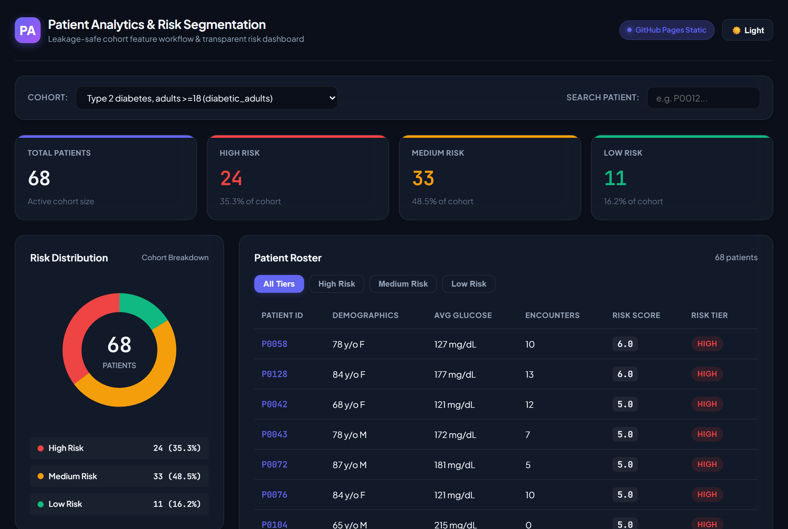
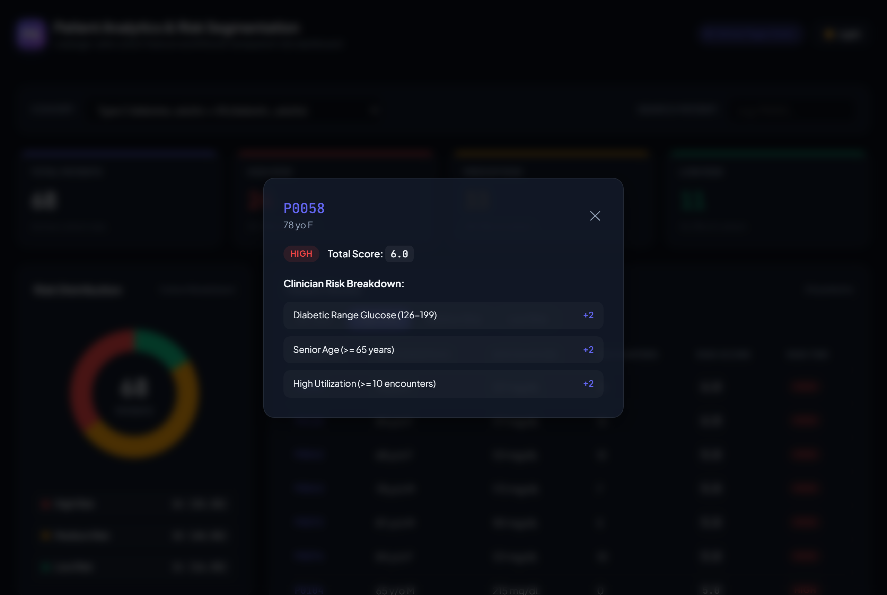

# Patient Analytics API — Cohort Risk Segmentation

[](https://sechan9999.github.io/patient-analytics/)
[](https://www.python.org/)
[](https://fastapi.tiangolo.com/)
[](tests/)
[](LICENSE)

Runnable FastAPI service that mirrors a real clinical-analytics workflow: a **leakage-safe cohort
feature workflow** + a **risk-segmentation endpoint** with query parameters, plus an interactive
dashboard. Two phases in one project — diagnose/fix cohort-reporting bugs, then extend the service
with a high-level risk-segmentation capability.

**▶ Live demo (no backend needed):** https://sechan9999.github.io/patient-analytics/



Click any patient for a transparent, clinician-auditable score breakdown:



## What's inside
```
patient-analytics/
├── app/
│   ├── data.py               # synthetic SQLite seed + corrected, point-in-time cohort query
│   ├── features.py           # risk_score + assign_tiers (transparent, null-safe, JSON-safe)
│   ├── main.py               # FastAPI app: endpoint + dashboard route
│   └── static/dashboard.html # zero-dependency dashboard (donut chart + high-risk table)
├── tests/test_api.py         # pytest coverage of every query-param path
├── seed.py                   # one-shot DB seeder
└── requirements.txt
```

## Dashboard
Two ways to view it:
- **Live (backend):** open `http://127.0.0.1:8000/` after starting the server — the dashboard calls
  the API live (`?include_patients=false` for stats, `?tier_filter=high` for the review list).
- **Static ([GitHub Pages](https://sechan9999.github.io/patient-analytics/)):** `index.html` reads
  pre-exported `data/*.json` snapshots, so the demo runs with no backend.

Features: risk-distribution donut, tier stat cards, sortable patient roster (high-risk first),
tier filter tabs, patient search, dark/light theme (system-aware, persisted), and a per-patient
audit modal explaining every point of the risk score.

## Run it
```bash
cd patient-analytics
pip install -r requirements.txt
python seed.py                          # build synthetic clinical.db
uvicorn app.main:app --reload           # http://127.0.0.1:8000/docs
```

## Endpoint
`GET /cohort/{cohort_id}/risk-segments`

| Param | Type | Default | Meaning |
|-------|------|---------|---------|
| `cohort_id` (path) | str | — | `diabetic_adults` or `hypertensive_adults` |
| `include_patients` | bool | `true` | include per-patient rows, or stats only |
| `tier_filter` | str | none | `low` \| `medium` \| `high` (bad value → **422**) |

### Examples
```bash
curl "http://127.0.0.1:8000/cohort/diabetic_adults/risk-segments"
curl "http://127.0.0.1:8000/cohort/diabetic_adults/risk-segments?tier_filter=high"
curl "http://127.0.0.1:8000/cohort/diabetic_adults/risk-segments?include_patients=false"
curl "http://127.0.0.1:8000/cohort/diabetic_adults/risk-segments?tier_filter=high&include_patients=false"
```

### Response
```json
{
  "cohort_id": "diabetic_adults",
  "total_n": 62,
  "filtered_n": 62,
  "tier_filter": null,
  "distribution": {"low": 20, "medium": 28, "high": 14},
  "patients": [{"patient_id": "P0002", "risk_score": 4.0, "risk_tier": "high"}]
}
```

## Second endpoint — supervised readmission risk

`GET /cohort/{cohort_id}/readmit-risk` (cohort: `hf_adults`)

Once a real label exists (`readmit_30d`), this moves from a rules score to a **supervised model**,
done leakage-safe: imputation inside the `Pipeline`, **patient-grouped `StratifiedGroupKFold`** for
an honest CV AUROC, `class_weight="balanced"` for imbalance, probability → fixed clinical-style tier
cutoffs. The response carries `model_version`, `cv_auroc`, and a **calibration** block (expected vs
observed high-tier rate) so downstream users can see if the model is over-confident.

```bash
curl "http://127.0.0.1:8000/cohort/hf_adults/readmit-risk?tier_filter=high"
```
```json
{
  "cohort_id": "hf_adults", "model_version": "lr-v1", "cv_auroc": 0.696,
  "total_n": 98, "filtered_n": 47, "tier_filter": "high",
  "distribution": {"low": 8, "medium": 43, "high": 47},
  "calibration": {"high_cutoff": 0.45, "high_mean_prob": 0.624, "high_observed_readmit_rate": 0.319}
}
```
Same hardened contract: `distribution` is the **full-cohort truth even when filtered**, `total_n`
stays separate from `filtered_n`, bad `tier_filter` → **422**, empty/unknown cohort → **404**.
Contract locked by `tests/test_readmit_contract.py`.

## Improvements over the draft endpoint
1. **`tier_filter` validated** → invalid tier returns `422`, not a confusing all-zero payload.
2. **`total_n` preserved** → the draft overwrote `n` with the filtered count and lost the cohort
   total; here `distribution` always reports the *full* cohort truth while `filtered_n` reflects
   the filter.
3. **JSON-safe types** → `risk_score`/`risk_tier` are cast from numpy/Categorical to `float`/`str`.
4. **Leakage-safe features** → cohort query is point-in-time (`<= index_date`), dedups diagnoses,
   drops deceased patients, treats glucose `0` as missing, avoids join fan-out.

## Test
```bash
pytest -q
```
